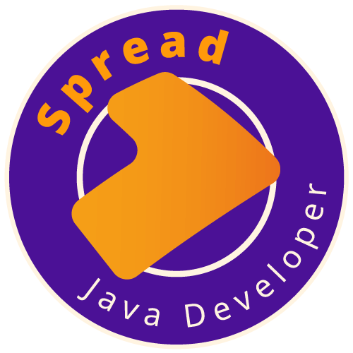

<h3 align="center">Abstraindo um Bootcamp Usando Orientação a Objetos em Java </h3>

  

Bootcamp Spread Java Developer da [Digital Innovation One](https://digitalinnovation.one/).

Desmistifique a Programação Orientada a Objetos (POO) com Java e pratique esse conceito fundamental nesse desafio. Para isso, os pilares da OO são devidamente formalizados: Abstração, Encapsulamento, Herança e Polimorfismo. Com isso, você poderá desenvolver sua capacidade de abstração com um problema real e implementar as evoluções que achar interessantes ;-)

<h2>Pré-Requisitos</h2>

* Conhecer a sintaxe da Java
* Java JDK 11
* IDE para desenvolvimento Java (usarei IntelliJ)
* Git
* Conta no GitHub
